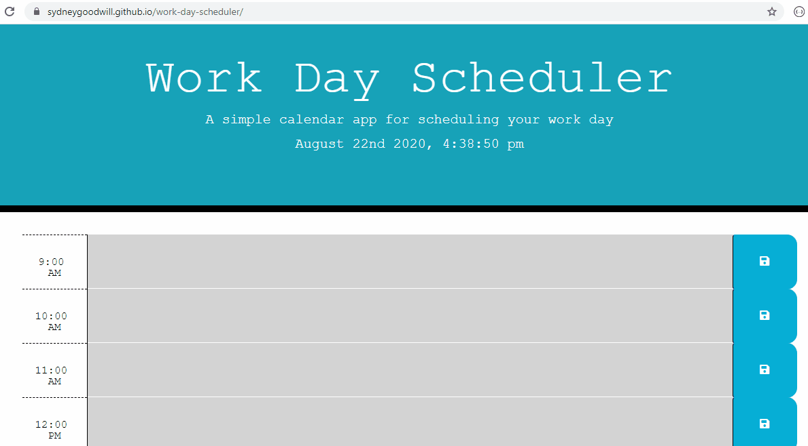

# work-day-scheduler

# Purpose

The purpose of this repository is to display a simple calendar app that allows the user to save events for each hour of the day. This app features dynamically updated HTML and CSS powered by jQuery. This app also utilizes the Moment.js library.

# Functioning the App

When the user enters text into a time slot on the calendar and presses 'save', that information will be saved to their local storage - meaning they can refresh the page, and their info will still be there. To delete information from the time slots, simply delete the previous text and press 'save'.

Link to the live site: [Work Day Scheduler](https://sydneygoodwill.github.io/work-day-scheduler/)

# GIF

The following animation demonstrates the application functionality:

# URL

https://github.com/SydneyGoodwill/work-day-scheduler/

# Works Cited and Resources

Between helpful peers, many internet searches, some tutorials and sample code, I was able to produce something that works! I would like to go back and make this project work even better.